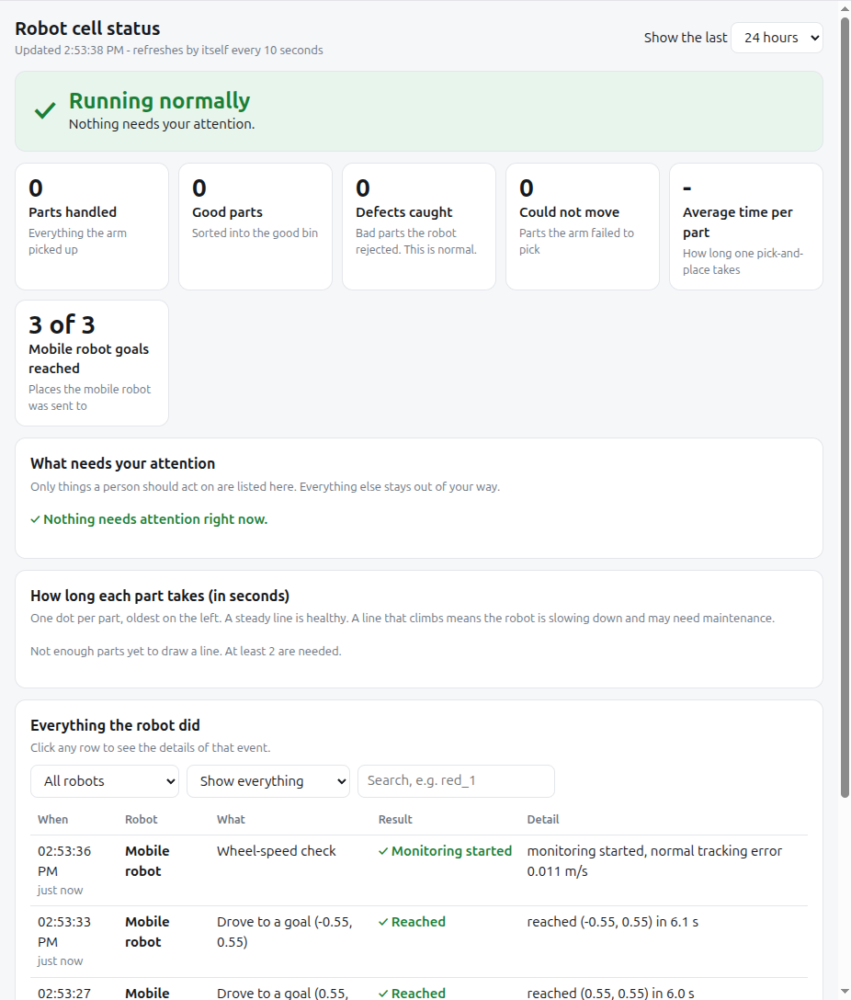
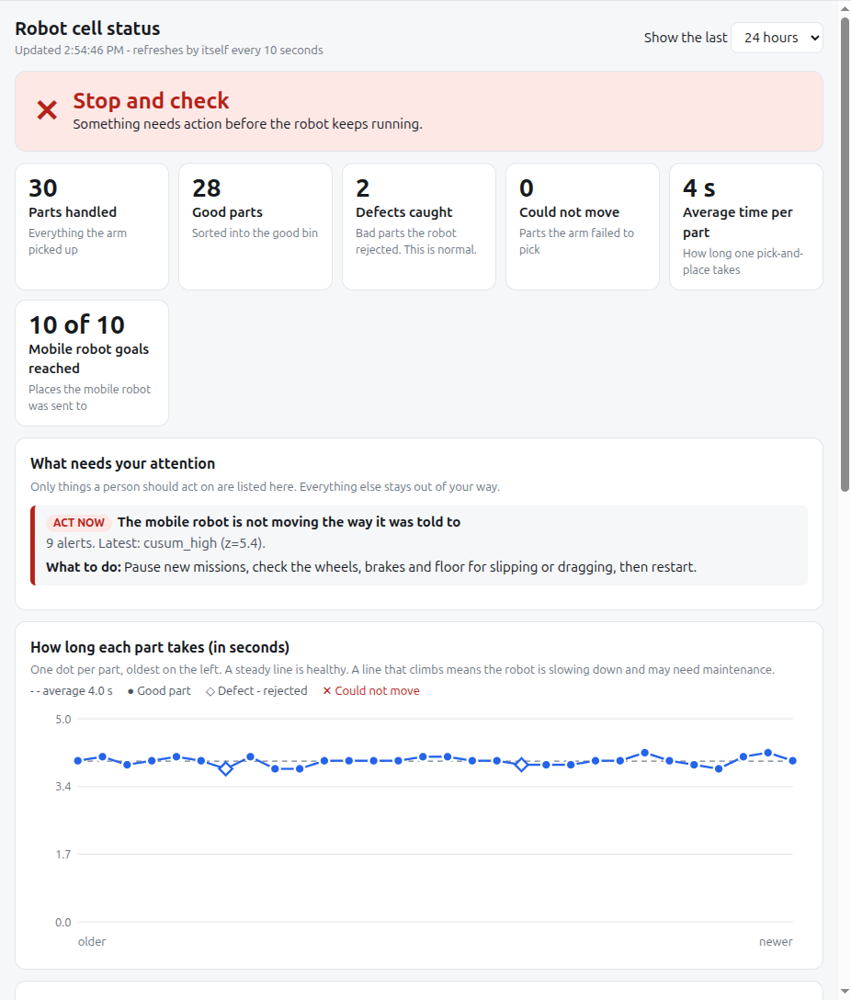

# Robotics QA Platform

A quality-assurance and health-monitoring layer for robot software, built around two robot
scenarios and one shared run-history dashboard.

| Package | What it does | Robot / stack |
|---|---|---|
| `dashboard/` | FastAPI + SQLite run-history service. The web page is written for non-technical readers: a green/amber/red status banner, a short "what needs your attention" list with what to do, a time-per-part trend chart, and a plain-language activity log. Also progressive filtering, keyset pagination and stats APIs | any client that can POST JSON |
| `cobot_qa/` | Inspection-and-sort cell for a 6-DOF arm: independent UR5e forward kinematics and a deterministic inverse-kinematics solver, workcell world with an overhead camera, colour-based block detection, a sort node that picks each part (virtual suction cup) and places it in the good or reject bin, and per-part reporting to the dashboard | Universal Robots UR5e, ROS 2 Jazzy, MoveIt 2, Gazebo Harmonic |
| `amr_health/` | Streaming anomaly detector (frozen baseline + spike + CUSUM) for AMR health signals, a velocity-tracking monitor node, and a fault injector to prove detection | Nav2 / TurtleBot3 on ROS 2 Jazzy |

## Why this exists

Robot projects usually have plenty of simulation and control work and very little automated
verification. This repo shows the layer that is often missing:

* **Regression tests that catch real failures.** For example, a reachability test that rejects
  a block placed 0.87 m from the base, the kind of mistake that makes a pick-and-place demo
  fail silently.
* **Measured detector behaviour, not guesses.** Detector thresholds were chosen from a sweep
  over false-alarm rate and detection delay (see [docs/ARCHITECTURE.md](docs/ARCHITECTURE.md)).
* **Results in one searchable place.** Every check posts to the dashboard, so failures can be
  filtered by project, status, text and metric range.

## Quick start (no ROS needed)

```bash
make setup                 # creates .venv and installs dependencies
. .venv/bin/activate
make test                  # 215 tests across the three packages
make lint                  # ruff
make serve                 # dashboard on http://127.0.0.1:8000  (terminal 1)
make demo                  # posts cobot + AMR results, saves docs/amr_detection.png (terminal 2)
make seed SCENARIO=slowing  # fills the dashboard with example data: healthy | slowing | defects | stuck | amr
```

Open http://127.0.0.1:8000 and try the project / status / search filters.

If ROS 2 is sourced in your shell, `make test` still works (it disables pytest plugin auto-loading);
see the troubleshooting note in [docs/TESTING.md](docs/TESTING.md) if you run pytest directly.

## Dashboard API

```
POST /runs                 record a run           {"project","name","status":"pass|fail|warn","metric","message","payload"}
GET  /runs                 filters: project, status, q, since, until, min_metric, max_metric, limit, cursor
GET  /runs/{id}
GET  /stats
GET  /health
```

Pagination is keyset-based (`cursor` = last id seen), so paging stays fast and stable while
new runs arrive.

## Running with ROS 2

The core logic is pure Python and fully tested. The ROS 2 nodes are thin wrappers and need a
ROS 2 Jazzy machine; the exact steps are in [docs/TESTING.md](docs/TESTING.md).

## What it looks like

Healthy, with the mobile robot reporting goals:



After the injected wheel fault is caught (arm and mobile robot on the same page):



## What has and has not been verified

* Verified in CI and locally: dashboard API, UR5e FK against a four-pose answer key, the deterministic
  IK solver (25 cell poses, accuracy, joint limits, floor clearance, one arm configuration for all of them),
  reachability, inspection and mission logic, workcell layout and world file, camera geometry, block
  detection on synthetic images (with mutation checks that the tests catch mirrored/flipped cameras), the
  sorting plan (targets, slots, destination), the dashboard report builder and HTTP client, and the
  anomaly detector (false alarms, step, drift, spike).
* Verified on a ROS 2 Jazzy / Gazebo Harmonic machine by the repo owner: the UR5e simulation with MoveIt,
  `fk_monitor_node` against Gazebo (45 consecutive `pass` rows, error below 0.001 mm), `spawn_cell`,
  the overhead camera (about 8 Hz) and `detect_node` (all four blocks within 1.0 to 2.6 mm of the layout),
  and the full sort cycle: all red parts to the green pad in separate slots, the blue part to the reject pad.
* Posting each sorted part to the dashboard is unit-tested and was checked against the real dashboard app
  over HTTP; the live-arm run of that step is documented in docs/TESTING.md section 6.
* Verified on the same machine, AMR half: Nav2 + TurtleBot3 in Gazebo patrolling by itself through
  `goal_runner_node` (10 of 10 goals reached and posted), `monitor_node` learning its baseline, and the
  dashboard turning red with "The mobile robot is not moving the way it was told to" about 70 s after the robot
  started driving, which matches the 60 s fault-injector delay. Both robots appear on one dashboard.
  Run steps: docs/TESTING.md section 7.
* The "suction gripper" is simulated: the held block is teleported under the tool 20 times a second.
  There is no contact physics for grasping. Sensor data in the anomaly demos is synthetic. Detector
  settings should be re-tuned on real recordings.

## Repository layout

```
dashboard/   FastAPI service + tests
cobot_qa/    kinematics + IK, cell layout, world + camera, detector, sorter, dashboard reporting, ROS nodes, sim/ launch + tests
amr_health/  detector, simulator, ROS nodes + tests
scripts/     offline end-to-end demo
docs/        architecture, ROS testing runbook, standards mapping
.github/     CI (tests per package, lint, docker build)
```

## Roadmap

1. Package the ROS nodes as ament packages with `launch_testing` integration tests.
2. Inspect parts from camera crops (the inspector already works on images) instead of by colour alone.
3. Collision-aware planning with MoveIt between waypoints, and a real gripper model (vacuum plugin or
   contact-based grasp) instead of the teleport-held block.
4. Add a real motor-current / effort signal to the AMR monitor on hardware.
5. Add authentication and Postgres to the dashboard for multi-user deployments.
